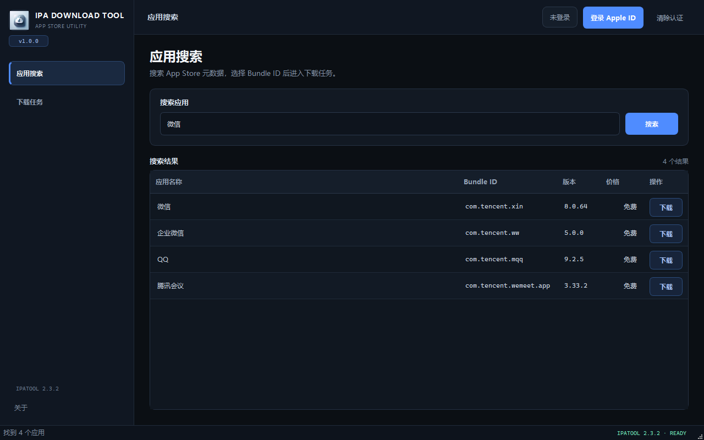

<div align="center">
  
  <h1>IPA Download Tool</h1>
  <p><strong>图形化 App Store IPA 下载工具</strong></p>
  <p>在 Windows 和 macOS 上完成应用搜索、Apple ID 登录、双重认证与 IPA 下载，无需操作 ipatool 命令行。</p>

  <p>
    <a href="https://github.com/qianshulab/ipatool-gui/releases/latest"></a>
    <a href="https://github.com/qianshulab/ipatool-gui/actions/workflows/windows-ci.yml"></a>
    <a href="https://github.com/qianshulab/ipatool-gui/actions/workflows/release.yml"></a>
    <a href="LICENSE"></a>
    
  </p>

  <p>
    <a href="https://github.com/qianshulab/ipatool-gui/releases/latest"><strong>下载最新版 v1.0.0</strong></a>
    · <a href="#使用方法">使用方法</a>
    · <a href="#从源码运行">源码运行</a>
    · <a href="https://github.com/qianshulab/ipatool-gui/issues">问题反馈</a>
  </p>
</div>

> [!NOTE]
> 本项目是独立的第三方客户端，不隶属于 Apple，也不是 Apple 官方产品。

## 界面



## 下载

发布包内置对应平台的 **ipatool 2.3.2**。安装后无需配置 Python 或额外的命令行工具。

| 平台 | 系统要求 | 下载 |
|---|---|---|
| Windows x86_64 | Windows 10 / 11 | [`.exe`](https://github.com/qianshulab/ipatool-gui/releases/download/v1.0.0/IPA-Download-Tool-1.0.0-windows-x86_64.exe) |
| macOS Apple Silicon | arm64 | [`.app.zip`](https://github.com/qianshulab/ipatool-gui/releases/download/v1.0.0/IPA-Download-Tool-1.0.0-macos-arm64.app.zip) |
| macOS Intel | x86_64 | [`.app.zip`](https://github.com/qianshulab/ipatool-gui/releases/download/v1.0.0/IPA-Download-Tool-1.0.0-macos-x86_64.app.zip) |
| 文件校验 | SHA-256 | [`SHA256SUMS.txt`](https://github.com/qianshulab/ipatool-gui/releases/download/v1.0.0/SHA256SUMS.txt) |

> [!IMPORTANT]
> Windows EXE 尚未进行 Authenticode 签名；macOS 应用尚未使用 Apple Developer ID 签名或公证。系统可能显示 SmartScreen 或 Gatekeeper 安全提示。请只从本仓库 Release 下载，并在运行前核对 SHA-256。

下载全部资产后，可在 Bash、Git Bash 或 macOS 终端中验证：

```bash
sha256sum -c SHA256SUMS.txt
```

## 核心功能

| 功能 | 说明 |
|---|---|
| App Store 搜索 | 按应用名称或关键词搜索，并从结果中发起下载 |
| Bundle ID 下载 | 直接输入 Bundle ID，可选自动获取免费应用许可 |
| Apple ID 与 2FA | 分阶段登录；Apple 要求验证时弹出独立的 6 位验证码窗口 |
| IPA 校验与保存 | 检查 ZIP 结构、应用身份和目标路径，再原子写入最终文件 |
| 下载状态 | 无法取得总字节数时显示忙碌状态，仅在校验并保存成功后显示 100% |
| 固定 ipatool 版本 | Windows 与 macOS 发布包均内置 ipatool 2.3.2，并在构建时核对来源、大小和 SHA-256 |

## 使用方法

### 1. 登录 Apple ID

1. 启动程序，点击顶部 **登录 Apple ID**。
2. 输入 Apple ID 邮箱和密码。
3. 如果 Apple 要求双重认证，输入受信任设备或 Apple 账户页面显示的最新 6 位验证码。
4. 验证码可粘贴为 `123 456` 或 `123-456`；无效或过期时，请获取新验证码后重试。

> [!WARNING]
> “记住凭据”默认关闭。启用后，邮箱和密码会明文保存在本机配置文件中，不应在公共或共享计算机上启用。

### 2. 选择下载方式

- **应用搜索**：打开左侧“应用搜索”，输入关键词并从结果中发起下载。
- **Bundle ID**：打开左侧“下载任务”，输入 Bundle ID，选择保存目录并开始下载。
- **自动获取许可**：仅在应用需要且你有权获取时启用。

### 3. 等待校验与保存

ipatool 的非交互协议不提供可靠的总下载字节数，因此下载和校验期间使用连续忙碌状态。程序只有在 IPA 结构、Bundle ID 和目标文件均验证成功并完成原子保存后，才显示 **100%**。

## 从源码运行

源码运行支持 Windows、macOS 和 Linux；推荐使用 Python 3.11。

```bash
git clone https://github.com/qianshulab/ipatool-gui.git
cd ipatool-gui
python -m venv .venv
```

安装依赖：

```bash
# Windows
.venv/Scripts/python -m pip install -r requirements.txt

# macOS / Linux
source .venv/bin/activate
python -m pip install -r requirements.txt
```

准备 ipatool：

- **Windows**：仓库已包含固定的 `ipatool-2.3.2-windows-amd64.exe`。
- **macOS Apple Silicon**：

  ```bash
  python -m scripts.fetch_ipatool_release --system Darwin --arch arm64 --output-dir .
  ```

- **macOS Intel**：将上面的 `arm64` 改为 `amd64`。
- **Linux**：从 [ipatool 官方 Release](https://github.com/majd/ipatool/releases/tag/v2.3.2) 获取对应架构版本，并放入 `PATH`。

启动程序：

```bash
python main.py
```

## 配置与隐私

配置文件默认位于：

- Windows：`%LOCALAPPDATA%\IPADownload\config.json`
- macOS / Linux：`~/.ipadownload/config.json`

需要了解的边界：

- 未启用“记住凭据”时，密码不会写入本应用配置；2FA 验证码始终不会持久化。
- 受 ipatool CLI 接口限制，登录期间邮箱、密码和验证码会短暂出现在 ipatool 子进程参数中，可能被同一用户、管理员或安全软件观察。
- Windows 上 ipatool 的认证缓存位于 `%USERPROFILE%\.ipatool`；请像保护账户凭据一样保护该目录。
- 本工具用于下载你有权访问的应用，不负责绕过授权、解密、重签名或安装 IPA。

## 故障排查

| 问题 | 建议 |
|---|---|
| 提示内置 ipatool 缺失 | 重新下载完整 Release；不要单独移动或删除应用包内文件 |
| 登录或 2FA 失败 | 核对邮箱、密码和最新验证码；服务暂时不可用时稍后再试，可使用“清除认证”重置本地状态 |
| 搜索无结果 | 检查网络、关键词和 Apple ID 所属地区 |
| 下载失败 | 检查登录状态、Bundle ID、应用地区可用性，以及是否需要先获取许可 |
| 系统阻止运行 | 核对 Release 来源和 SHA-256 后，按 Windows“应用和浏览器控制”或 macOS“隐私与安全性”中的系统提示处理 |

## 开发与发布

```text
ipatool-gui/
├── core/           # ipatool 协议、配置、脱敏与原子文件操作
├── ui/             # PyQt6 界面、对话框与后台 Worker
├── scripts/        # 固定依赖获取和发布产物验证
├── tests/          # 单元、UI、归档与 Release 合同测试
├── third_party/    # 第三方许可证与机器可读来源清单
└── main.py         # 应用入口
```

运行测试：

```bash
QT_QPA_PLATFORM=offscreen python -m unittest discover -s tests -v
```

推送 `v*` tag 后，[Release workflow](.github/workflows/release.yml) 会在 GitHub 托管的 Windows x86_64、macOS Intel 和 macOS Apple Silicon runner 上测试、构建、校验并发布产物。手动运行该 workflow 只执行三平台构建验证，不创建 Release。

<details>
<summary><strong>Windows 可复现构建命令</strong></summary>

以下命令面向干净的 Windows x64 / Python 3.11.15 环境，并要求清空 `PYTHONPATH`：

```bash
python --version
python -m pip install --disable-pip-version-check --require-hashes --only-binary=:all: -r requirements-lock.txt

# 仅在有意更新依赖时重新生成锁文件
uv pip compile requirements-dev.txt --python-platform x86_64-pc-windows-msvc \
  --python-version 3.11.15 --generate-hashes --only-binary :all: \
  -o requirements-lock.txt

python scripts/verify_release_inputs.py
python -m scripts.prepare_package_metadata --windows-version-file build/windows-version-info.txt

python -m PyInstaller --noconfirm --clean --windowed --onefile \
  --name "IPA-Download-Tool" \
  --icon "assets/exe.ico" \
  --version-file "build/windows-version-info.txt" \
  --add-data "assets/exe.png;assets" \
  --add-data "LICENSE;." \
  --add-data "THIRD_PARTY_NOTICES.md;." \
  --add-data "third_party;third_party" \
  --add-binary "ipatool-2.3.2-windows-amd64.exe;." \
  main.py

python scripts/verify_built_archive.py dist/IPA-Download-Tool.exe
```

</details>

<details>
<summary><strong>内置 ipatool 来源与完整性</strong></summary>

所有发布版固定使用官方 ipatool v2.3.2：

- 上游标签：[`v2.3.2`](https://github.com/majd/ipatool/tree/v2.3.2)
- 上游提交：`ab79e429d5d5d3da6879711f6e04b8a240aabd94`
- 许可证：MIT，见 [`third_party/ipatool/2.3.2/LICENSE`](third_party/ipatool/2.3.2/LICENSE)
- 机器可读来源、大小与摘要：[`third_party/ipatool/2.3.2/manifest.json`](third_party/ipatool/2.3.2/manifest.json)

构建脚本启用系统 TLS 证书校验，按平台与架构校验固定归档和可执行文件的大小及 SHA-256，并拒绝清单外成员。

</details>

## 许可证与致谢

本项目源码及官方发布版采用 [`GPL-3.0-only`](LICENSE)。发布包内第三方组件的固定版本、来源和许可信息见 [`THIRD_PARTY_NOTICES.md`](THIRD_PARTY_NOTICES.md) 与 [`third_party/`](third_party/)。

感谢以下项目与服务：

- [ipatool](https://github.com/majd/ipatool) — 核心 App Store 下载工具
- [PyQt6](https://www.riverbankcomputing.com/software/pyqt/) — 桌面 GUI 框架
- Apple App Store — 应用分发服务

## 支持与免责声明

问题和建议请通过 [GitHub Issues](https://github.com/qianshulab/ipatool-gui/issues) 提交。报告问题时请移除 Apple ID、密码、验证码、Cookie、Authorization 和其他敏感信息。

本工具仅供合法、合规用途。使用者应遵守 Apple 服务条款、应用许可和所在地法律法规，并仅下载自己已购买或有权使用的应用。